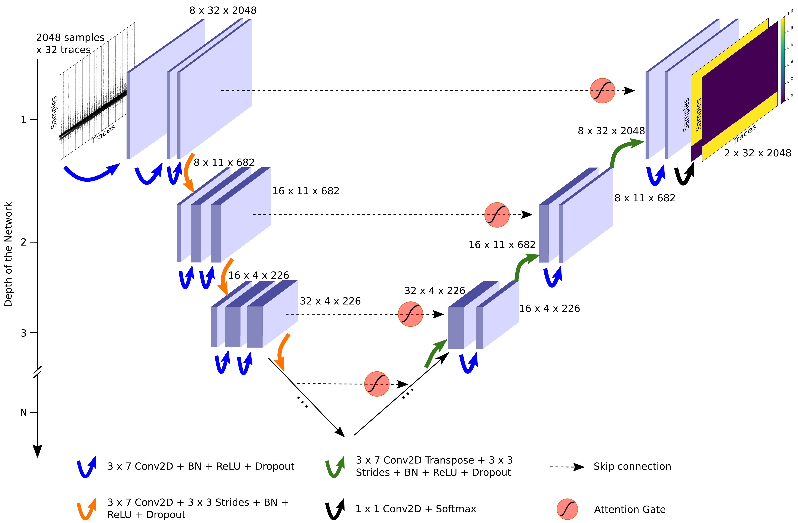
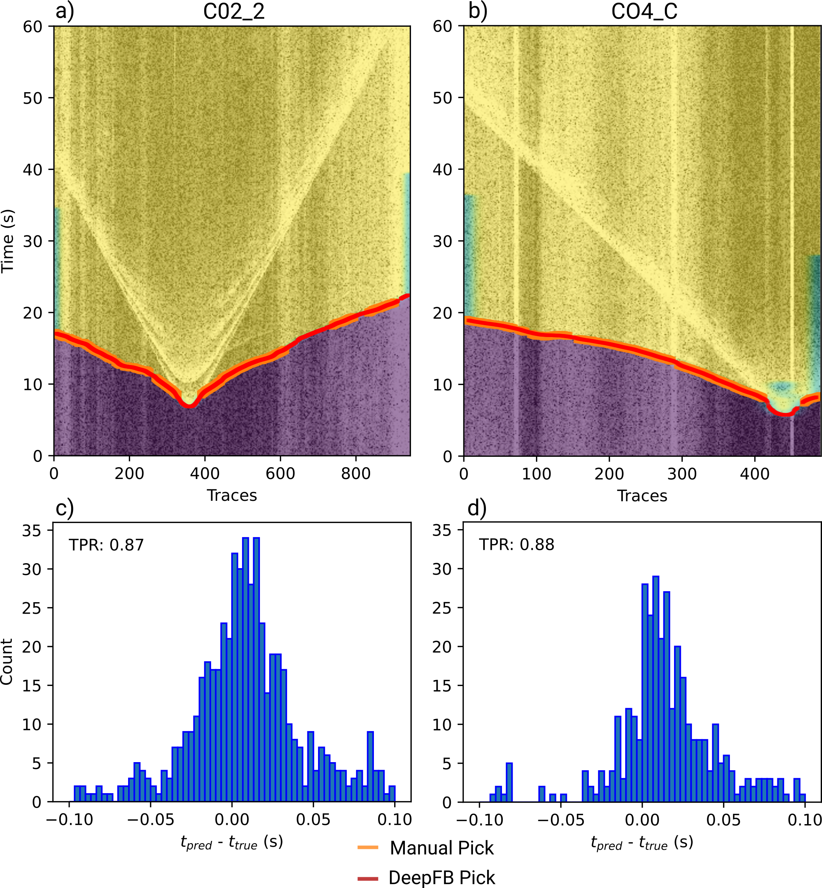

# DeepFB (automatic first-break picking in active-source seismic data)

## Introduction
DeepFB is a U-Net–based neural network designed for robust automatic first-break picking
in active-source seismic data. The model operates on overlapping chunks  of multiple
traces, preserving temporal resolution while exploiting spatial correlations.
Automated hyperparameter optimisation using the evolutionary algorithm
[Propulate](https://github.com/Helmholtz-AI-Energy/propulate)
yielded optimal model configurations without manual tuning.
Trained models, a small dataset for training and a dataset for testing are included
into this package.

## Installation
Either download this repository or run `pip install git+https://github.com/JanisHe/FirstBreakPicking`.

## Requirements
- `pytorch`
- `obspy`
- `pandas`
- `numpy`
- `scipy`
- `matplotlib`
- `torchsummary`
- `propulate` only for optimization (https://github.com/Helmholtz-AI-Energy/propulate)
- `mpi4py` only for optimization

## Datasets and Models

Example datasets for testing and fully trained models are available:

- Training datasets: `examples/train_data`
- Test datasets: `examples/test_data` <br>
  The directory contains `metadata` and `npz_files` as seismic data
- Trained models: `examples/models` <br>
  `.pt` files are the weights and `.json` files contain further information about
  the neural network architecture.

## Train and Apply DeepFB
### Training
The script `examples/train_model.py` contains an example how the train the DeepFB
model with code from the example dataset. Different loss functions and batch sizes,
among other hyperparameters can be selected by the user. Also the neural network
architecture can be selected by the user (see code example below).

### Neural network architecture


The architecture of the network can be changed by the following code snippet:
```python
from fbp.src.unet import UNet

model = UNet(
    depth=2,
    kernel_size=(3, 7),
    stride=(3, 3),
    skip_connections=True,
    out_channels=2,
    filters_root=8,
    output_activation=torch.nn.Softmax(dim=1),
    drop_rate=0.0,
    attention=True,
)
```

### Optimization

The script `example/optimization.py` contains an example how to optimize a neural
network using the evolutionary algorithm [Propulate](https://github.com/Helmholtz-AI-Energy/propulate) .
The selection of the hyperparameters is done is the `main` part of the script.
Note that test files are necessary in order to find the best performing model on the
test dataset.

### Detecing First-Breaks

Workflow how to detect first-breaks from a seismic section: First, the whole section (a) is divided into overlapping
chunks, where each chunk has a size of 32 traces and 2048 samples (b). Second, the
previously trained DeepFB model is applied to each chunk of data (c). Afterwards,
the predicted output is concatenated to obtain a whole map containing the first-breaks
for the whole section (d). Since each single seismic trace can have several predictions
due to the overlapping, all predicted data are merged together either by taking the
average or the maximum value from all predictions. In the next step, the predicted
output for the whole section is convolved with a 2D Gaussian filter to remove jumps
and smoothing first-breaks (e). In the last step, the first-break is detected for each
trace by finding a certain threshold value for the predicted output map (f). Due
to the overlap, we can calculate the first-breaks for each trace several times during
the prediction. With this approach, it is possible to calculate the standard
deviation of all predicted first-breaks for each trace and thus remove picks if the
standard deviation exceeds a certain threshold (std threshold).

### Testing

Testing the trained models on the example test dataset can be done by running the
code in `examples/apply_model_reduced_test.py`. The model can be changed by
selecting a different pretrained models from all availabel models in
`examples/models` and by changing the following line:
```python
model_filename = "./models/deep_fb_propulate_0.1_no_std.pt"
```

## Citation
Heuel, J., Delsuc, A., Weiel, M., Coquelin, D., Götz, M., Rietbrock, A. (2025).
Optimising Deep-Learning First-Break Picking. Submitted to RAS Techniques and Instruments
